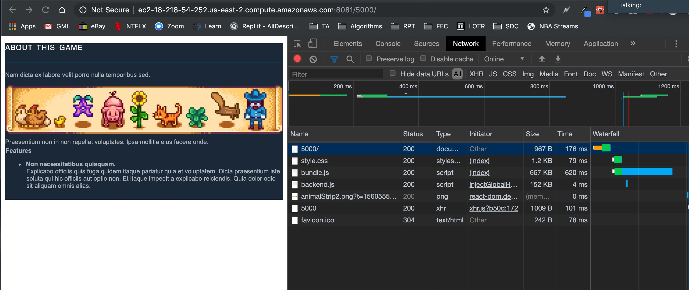
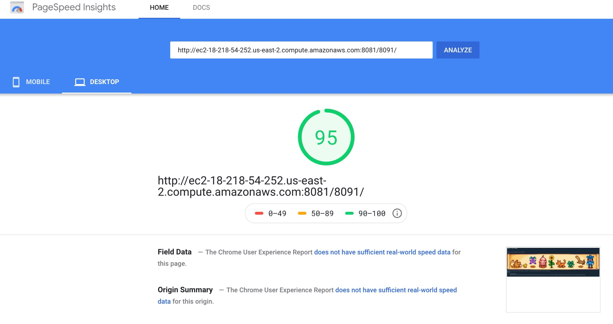

# RPT15 - FEC - Dr. Floyd

> This is the Features microservice for the Steam Page Clone

## Related Microservice Projects

- https://github.com/rpt15-dr-floyd/Josh_Overview

- https://github.com/rpt15-dr-floyd/zack-reviews-service
### Related Proxy Projects
- https://github.com/rpt15-dr-floyd/Justin_Proxy-Stephen_Clone

- https://github.com/rpt15-dr-floyd/zack-proxy

- https://github.com/rpt15-dr-floyd/Josh_Proxy-Stephen_Clone


## Usage


This App is part of a Steam Page clone.
This microservice is the features service, which displays the data for the game.
In order to display the proper data to the user, the endpoints below are used.

## Requirements

- Node v11.6.0


### Installing Dependencies

From within the root directory:

```sh
npm install
npm install -g webpack

```

### 1.1 API endpoints

- `GET /api/features/:gameId?`
  - returns data for specific id ( aboutHeader, aboutBody, featureTitle, features)
- `POST '/api/features/`
  - post a new game to specified id (within the req.body with: (aboutHeader, aboutBody, featureTitle, features))
- `PUT /api/features/:gameId?`
  - updates game with specified id (within the req.body with: (aboutHeader, aboutBody, featureTitle, features))
- `DELETE /api/features/:gameId?`
  - deletes game with specified id

### 1.2 Development SetUp
This service uses the following dev stack: 
* Server: node/NPM
* Deployment: EC2
* DB: PostgresSql, Redis
* Client: React
* Important Libraries:
  * faker.js
  * sequelize

### 1.3 PostGres Seeding SetUp

To handle the 10M heap memory storage, a recursive function had to be written.  The seeding were broken down into bulk inserted arrays of 1000 tables:

```
const { Game } = require('./postgres.js');
const faker = require('faker');
const { sequelize } = require('./postgres.js');

const postgresDataSeed = (index, target) => {
  if (index < target / 1000) {
    let bulkData = [];
    for (let i = 0; i < 1000; i++) {
      bulkData.push({
        aboutHeader: faker.lorem.sentence(),
        aboutBody: faker.lorem
          .paragraph(
            (nb_sentences = 1),
            (variable_nb_sentences = true),
            (ext_word_list = null)
          )
          .slice(0, 250),
        featureTitle: faker.lorem.sentence(
          (nb_words = 3),
          (variable_nb_words = true),
          (ext_word_list = null)
        ),
        features: faker.lorem
          .paragraphs(
            (nb_sentences = 1),
            (variable_nb_sentences = true),
            (ext_word_list = null)
          )
          .slice(0, 250)
      });
    }

    Game.bulkCreate(bulkData)
      .then(() => {
        index++;
        console.log(
          `you have successfully inserted ${index *
            1000} documents into postgres `
        );
        postgresDataSeed(index, target);
      })
      .catch(err => {
        console.log(err);
      });
  }
};

sequelize
  .sync({
    force: true
  })
  .then(() => {
    console.log('created tables if they do not exist');

    postgresDataSeed(0, 10000000);
  });
  
  ```
To run the seeding script:
npm run seedPostgres


### 1.4.1 Loader.IO Test


### 1.4.2 Deployed Load testing (Loader.io)


|                             | 1rps                      | 10rps                     | 100rps                     | 1000rps                       |
|-----------------------------|---------------------------|---------------------------|----------------------------|-------------------------------|
| Loader.io (single instance) | `26 ms` Latency / `0%` errors | `24ms` Latency / `0%` errors | `24ms` Latency / `0%` errors | `24` Latency / `0% +` errors |

### 1.5.1 GZIP and Brotli Bundle Compression Optimization:

GZIP and BROTLI compression for the bundle js, went from 2,856 KB to 667 KB


indexPostgres.js file
```
const expressStaticGzip = require('express-static-gzip');

app.use(
  '/:gameId',
  expressStaticGzip('public/dist', {
    enableBrotli: true,
    orderPreference: ['br', 'gz']
  })
);
```

webpack.config.js
```
  plugins: [new CompressionPlugin(), new BrotliPlugin()],
  output: {
    filename: 'bundle.js',
    path: __dirname + '/public/dist'
  }
 ```



Page Speed Insights after Gzip and Brotli Compression Optimization




### 1.6.1 Redis Cache

Requiring Redis on indexPostgres.js file
```
const redis = require('redis');
var redisHost = 'XXXXXXXXXXXXX.ec2.cloud.redislabs.com';
var redisPort = XXXXX;
var redisAuth = 'XXXXXXXXXXXXXXXXXXXXXXXX';
var client = redis.createClient(redisPort, redisHost, { no_ready_check: true });
client.auth(redisAuth, function(err) {
  if (err) {
    console.log(err);
  }
});
client.on('error', function(err) {
  console.log('Error ' + err);
});
client.on('connect', function() {
  console.log('Connected to Redis thumbs up');
});
```
Conditional Statements within the Get Request:

```
app.get('/api/features/:gameId', (req, res) => {
  let gameId = req.params.gameId;

  //using redis cache to check key value pairs to return faster query result times
  client.get(gameId, (err, val) => {
    if (err) {
      console.log(err);
    } else if (val) {
      console.log('getting a cache val', val);
      //redis cache makes use of stringified values, so make sure to parse back to front end
      res.status(200).send(JSON.parse(val));
    } else {
      console.log('using sequelize db');
      Game.findAll({ where: { id: gameId } })
        .then(data => {
          console.log(`you have searched ${gameId}`);
          //setting db cache with recently searched data, redis needs stringified values
          client.set(gameId, JSON.stringify(data));
          res.status(200).send(data);
        })
        .catch(err => res.status(404).send('no id has matched', err));
    }
  });
});
```


## Requirements

- Node 6.13.0


### Installing Dependencies

From within the root directory:

```sh
npm install
npm install -g webpack

```


