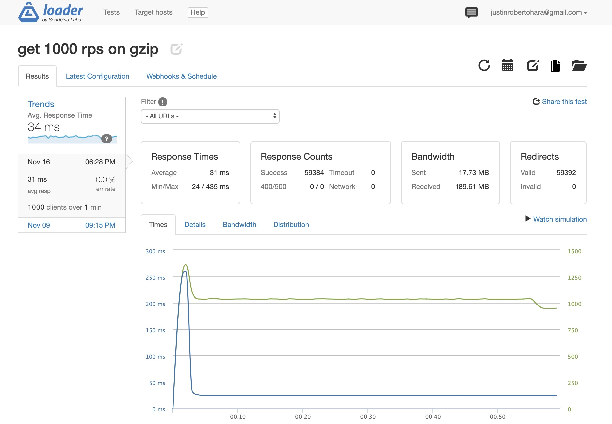

# RPT15 - FEC - Dr. Floyd

> This is the Features microservice for the Steam Page Clone

## Related Microservice Projects

- https://github.com/rpt15-dr-floyd/Josh_Overview
- https://github.com/rpt15-dr-floyd/zack-reviews-service
### Related Proxy Projects
-https://github.com/rpt15-dr-floyd/Justin_Proxy-Stephen_Clone
-https://github.com/rpt15-dr-floyd/zack-proxy
-https://github.com/rpt15-dr-floyd/Josh_Proxy-Stephen_Clone

## Table of Contents

1. [Usage](#Usage)
1. [Requirements](#requirements)
1. [Development](#development)

## Usage


This App is part of a Steam Page clone.
This microservice is the features service, which displays the data for the game.
In order to display the proper data to the user, the endpoints below are used.

### 1.1 API endpoints

- `GET /api/features/:gameId?`
  - returns data for specific id ( aboutHeader, aboutBody, featureTitle, features)
- `POST '/api/features/`
  - post a new game to specified id (within the req.body with: (aboutHeader, aboutBody, featureTitle, features))
- `PUT /api/features/:gameId?`
  - updates game with specified id (within the req.body with: (aboutHeader, aboutBody, featureTitle, features))
- `DELETE /api/features/:gameId?`
  - deletes game with specified id

### 1.2 Development SetUp
This service uses the following dev stack: 
* Server: node/NPM
* Deployment: EC2
* DB: PostgresSql
* Client: React
* Important Libraries:
  * faker.js

### 1.3 PostGres Seeding SetUp
npm run seedPostgres

### 1.4 Loader.IO Test



### 3.1.1 Deployed Load testing (Loader.io)


|                             | 1rps                      | 10rps                     | 100rps                     | 1000rps                       |
|-----------------------------|---------------------------|---------------------------|----------------------------|-------------------------------|
| Loader.io (single instance) | `15 ms` Latency / `0%` errors | `53ms` Latency / `0%` errors | `98ms` Latency / `0%` errors | `224` Latency / `60% +` errors |

### 3.1.2 With Self-Made Load Balancer - Deployed Load testing (Loader.io)


|                             | 1rps                      | 10rps                     | 100rps                     | 1000rps                       |
|-----------------------------|---------------------------|---------------------------|----------------------------|-------------------------------|
| Loader.io (single instance) | `102ms` Latency / `0%` errors | `432ms` Latency / `0%` errors | `1280ms` Latency / `0%` errors | `2933 wms` Latency / `60% +` errors |

### 3.1.3 With Nginx Load Balancer - Deployed Load testing (Loader.io)


|                             | 1rps                      | 10rps                     | 100rps                     | 1000rps                       |
|-----------------------------|---------------------------|---------------------------|----------------------------|-------------------------------|
| Loader.io (single instance) | `14ms` Latency / `0%` errors | `43ms` Latency / `0%` errors | `128ms` Latency / `0%` errors | `183` Latency / `60% +` errors |


## Requirements

An `nvmrc` file is included if using [nvm](https://github.com/creationix/nvm).

- Node 6.13.0
- etc

## Development

### Installing Dependencies

From within the root directory:

```sh
npm install -g webpack
npm install
```


